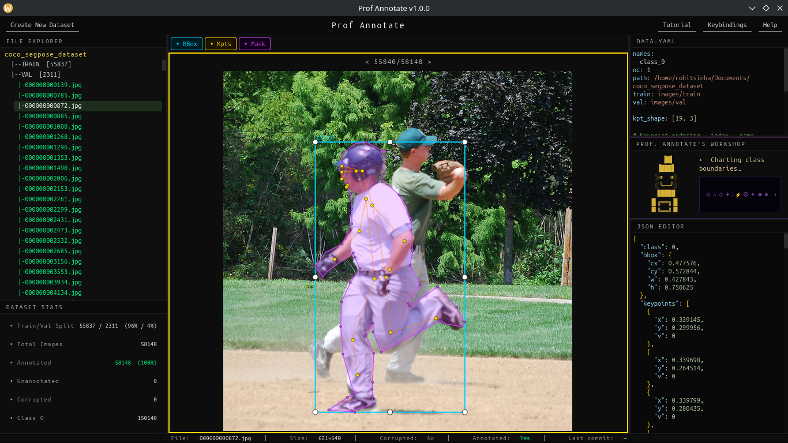

# Prof Annotate



Prof Annotate is a terminal style software made with PySide6, for making a easier approach to data annotation for human datasets. Currently focused on human only datasets, working with detection, pose and segmentation, I plan to add more features and support for other datasets as well. The focus point arises as the auto-annotation model (a custom YOLO11 whole-body seg-pose model) is primarily trained on human datasets, therefore can only auto annotate human images but with some caveats in accuracy due to its lightweight nature. However if the user wishes they can manually annotate any image according to their use case for detection, classification and segmentation, for pose there are 133 whole-body keypoints (COCO-WholeBody: body, face, hands and feet) that are made with human pose kpts in mind, they will be subject to improvement in upcoming updates. 

The build has been made on CachyOS (Arch-based, x86_64), but the AppImages in the Releases section can be downloaded and run on Ubuntu/Debian based distros as well. I have not tested it on Fedora machines but I think that will work just as well. Please refer to the releases section to find the appropriate AppImage binary to install according to your machine.

**Windows:** prebuilt portable `.exe` files (CPU and GPU/CUDA 12) are published in the Releases section as well — just download and run, no installation needed. They are built automatically on Windows runners via GitHub Actions; to build one locally see [Building on Windows](#building-on-windows).

Currently the build doesnt support aarch64(Raspberry Pi devices), but that is a future target to achieve as well.

## Requirements

- Python >= 3.10
- pip >= 23
- Git
- Linux (AppImage build), Windows, or macOS
- (Optional) NVIDIA GPU + CUDA 11.8+ for GPU-accelerated inference

---

## Quick Start

```
git clone <repo-url> profannotate
cd profannotate
bash scripts/setup.sh
```

Then launch:

```
source .venv/bin/activate
python main.py
```
---

## Manual Setup

### 1. Create and activate a virtual environment

```bash
python3 -m venv .venv
source .venv/bin/activate        # Linux / macOS
.venv\Scripts\activate           # Windows
```

### 2. Upgrade pip

```bash
pip install --upgrade pip
```

### 3. Install dependencies

CPU-only (default):
```bash
pip install -e .
```

GPU (CUDA) — replaces the CPU onnxruntime:
```bash
pip install -e .
pip uninstall -y onnxruntime
pip install onnxruntime-gpu>=1.17.0
```

### 4. Place the ONNX model

Download or copy wb_s_full100_best.onnx into the models/ directory:

```
profannotate/
└── models/
    └── wb_s_full100_best.onnx
```

The application will start without it, but auto-annotation will not work.

### 5. Run

```bash
python main.py
```

---

## Building on Windows

Releases ship prebuilt Windows `.exe` files, but you can also build one locally.
With the virtual environment active and dependencies installed (steps above), add
the build extras and run the Windows build script:

```bat
pip install nuitka ordered-set zstandard
python build\build_windows.py cpu          REM or: gpu-cuda12
```

This compiles a single portable `ProfAnnotate-<variant>-windows-x64.exe` into the
repo root via Nuitka (it downloads its own C toolchain on first run). The
`gpu-cuda12` variant uses `onnxruntime-gpu` and falls back to CPU when no CUDA is
present. The same script runs in CI — see `.github/workflows/release.yml`.

## Project Structure

```
profannotate/
├── main.py
├── docs/                   Detailed documentations on software
├── scripts/
│   └── setup.sh
├── assets/                 Fonts, icons, QSS theme
├── models/                 ONNX model (wb_s_full100_best.onnx)
├── src/
│   ├── config/             constants, shortcuts, skeleton
│   ├── core/
│   │   ├── annotation/     models, parser, writer, undo
│   │   ├── dataset/        loader, validator, yaml_handler, wizard worker
│   │   ├── inference/      ONNX engine, postprocess, filter
│   │   ├── git/            read-only git log reader
│   │   └── recovery/       autosave / session restore
│   └── ui/
│       ├── main_window.py
│       ├── tutorial.py
│       ├── prof_annotate.py
│       ├── prof_watcher.py
│       ├── dialogs/
│       ├── drawing/
│       ├── overlays/
│       └── widgets/
└── tests/
```

## Usage
For extensive usage documentation please refer to the docs dir of the project.

---

## License

GPL v2 — see LICENSE.
