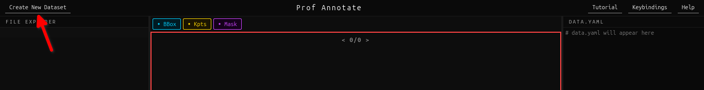

# Create New Dataset

To create a new dataset, the annotator clicks on the Create New Dataset button on the top left of the top panel,



## Steps to create a new dataset:

1. After clicking on it the annotator is shown a dir popup from where they can choose the folder they wish to make a new dataset from. After clicking on the open button, the annotator will be asked if they wish to add another dataset, to the already chosen one, they may then choose to either proceed with the single dataset or choose and another dataset to merge with the first chosen dataset. The annotator need not worry as Prof Annotate will himself mash and merge the two datasets, which is not just simple concatenation but proper mixing of the two datasets, allowing randomization to avoid the chance of one dataset images being on the smaller test set after splitting. 

2. After proceeding with their choices of datasets, the annotator is asked of the modalities they wish to annotate, the current options are Bounding Box, Keypoints and Segmentation Masks. The annotator may choose one or more of these modalities to annotate.

3. After proceeding with their choices of modalities and if they select keypoints amongst them, the annotator is asked of the keypoints they wish to annotate, they can choose from the 133 keypoints (17-BODY KEYPOINTS, 68-FACE KEYPOINTS, 21-HAND KEYPOINTS AND 6 FEET KEYPOINTS). Else if they do not choose to annotate keypoints they are directed to the auto annotation choice popup directly.

4. After choosing their desired set of keypoints, the annotator is asked if they wish to manually annotate or auto annotate the task in the dataset. If chosen to auto annotate the yolo11n-segpose model will auto annotate the images, however only the selected choice of modalities will be saved in the label files.

5. After proceeding with their choices of modalities and if they select keypoints amongst them, the annotator is asked of the keypoints they wish to annotate, they can choose from the 133 keypoints (17-BODY KEYPOINTS, 68-FACE KEYPOINTS, 21-HAND KEYPOINTS AND 6 FEET KEYPOINTS). Else if they do not choose to annotate keypoints they are directed to the auto annotation choice popup directly.

6. After choosing their desired set of keypoints, the annotator is asked if they wish to manually annotate or auto annotate the task in the dataset. If chosen to auto annotate the yolo11n-segpose model will auto annotate the images, however only the selected choice of modalities will be saved in the label files. Additionally the annotator may choose to manually annotate themselves as well.

7. After this they are asked about the train-val split, which by default is 80-20. The annotator may adjust this to their liking and the dataset will be split into train and val subsets accordingly.

8. After confirming all of the details, the annotator, is asked to confirm the set of choices that they have made, they may cancel and provide their input again or else when they press on the proceed button, Professor Annotate starts preparing the dataset for annotation.

## Completion:

After completion of all the processes of processing the dataset, the dataset is saved in the physical disk, the dataset will always be in the YOLO compatible format, i.e. will maintain the following directory structure

```bash
datasetname_date_timestamp
    |--images
        |---train
        |---test
    |--labels
        |---train
        |---test
    |--data.yaml
```

The original folder/folders will not be affected or changed a new directory will be made with the naming format as foldername_date_timestamp (for dataset created from single folder) and foldername1_foldername2_date_timestamp (for dataset created from 2 folders) and so on.

The annotator need not worry about the structuring and file creation, Prof Annotate knows the proper spells to conjure them up in the right place, creating a proper YOLO format dataset within minutes, complete with the label files and a pre-built data.yaml from the chosen configs while creating the dataset.

After completion, the dataset will be auto opened on the software for the annotator to then make changes and perform edits and corrections on the auto annotated labels or manually annotate the dataset themselves. This will automatically populate the dir view, stats panel, data.yaml editor and canvas.
