# Startup and Tutorial
Upon successful startup, the user will be greeted by Prof Annotate, the enigmatic entity that acts as the personification of the annotation software. He will be the guide, helper and teacher who shall alert, enquire and provide the tutorial on his workshop to the annotator.

After startup the annotator is greeted with a tutoial page, if by any chance the page is not started, the annotator can themselves start the tutorial by clicking on the Tutorial button on the top right of the panel beside the Keybindings button. 

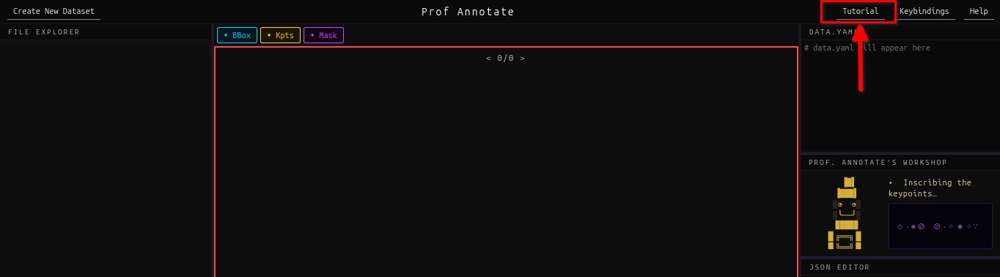

After clicking, the following window will start up commencing the tutorial. 

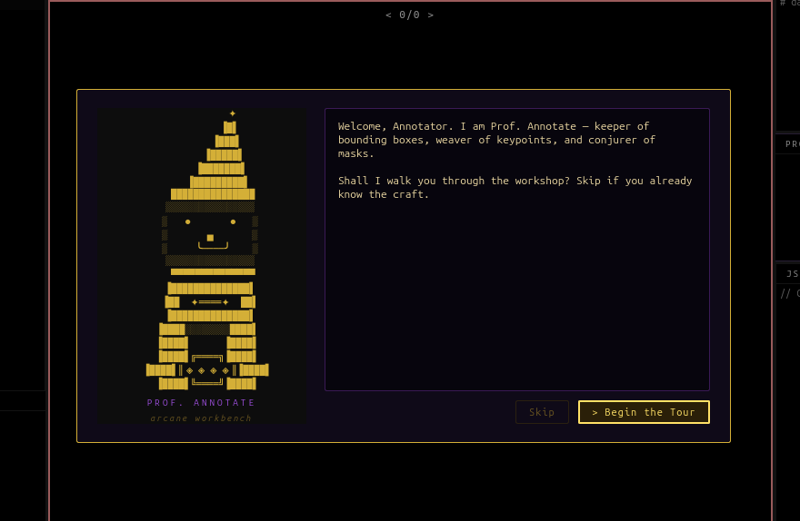

## Tutorial

1. Click on the Begin the Tour button to start the tutorial.

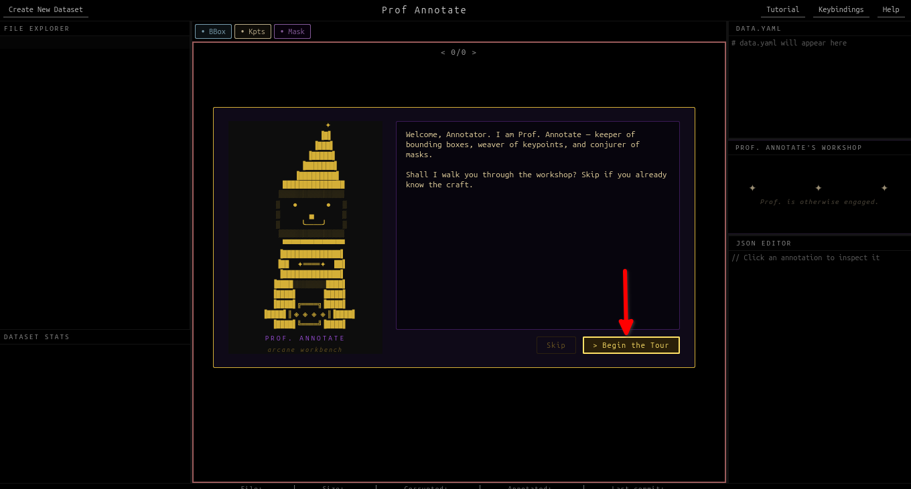

After this the annotator may press Enter key or Click on the Next button to proceed to the next step. They may also choose to click on the Back button to go back to the previous step. Optionally, they may click on the Skip button to skip the tutorial and proceed to the main application.

2. Create a Dataset Button:

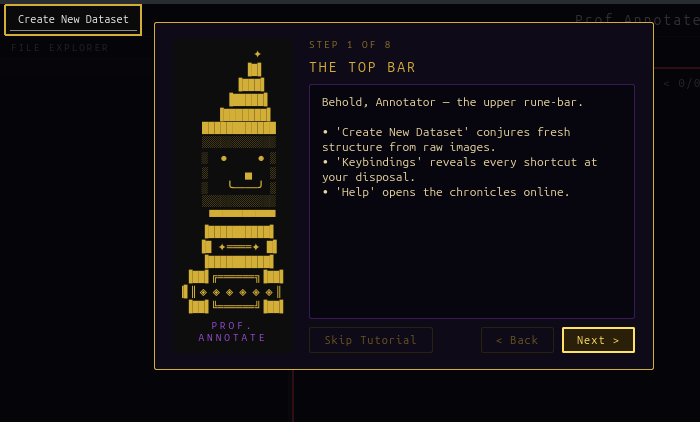

This button allows the annotator to open a dataset as a new dataset, post which they will be provided options on how they wish to start working on it. For details please refer to the CreateNewDataset.md file.

3. The File Explorer:

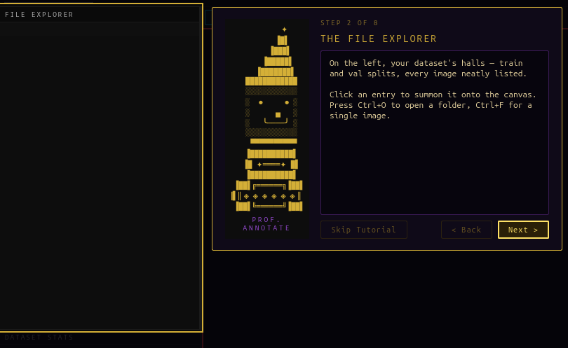

This section allows the annotator to browse and select files from their local machine to annotate. The annotator can press Ctrl + O to open a folder and Ctrl + F to open a file. The files whose names are shown in green color have existing annotations and can be edited. The files that are shown in yellow color have no existing annotations and are currently annotated from scratch. The files are shown in red color are the files that do not have any annotation file mapped to them.

4. The Stats Panel:

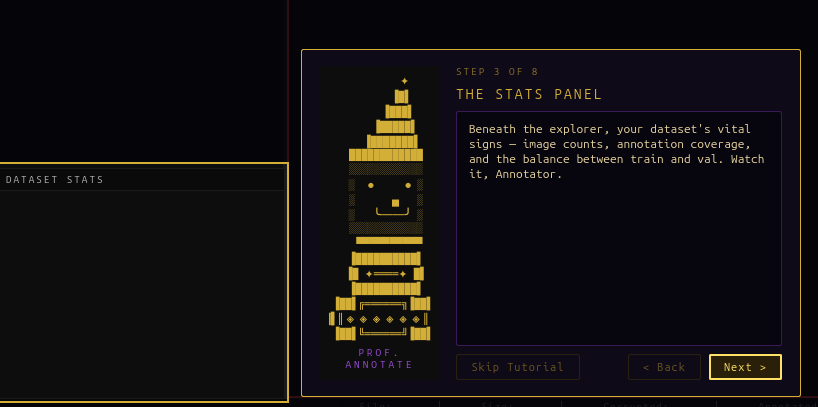

The stats panel where the annotator can at a glance see the train/val split, total images in the dataset, number of files that are annotated, number of files that are missing annotations, number of corrupted images, and classes of annotated objects and their respective counts.

5. The Modality Toggles Panel: 

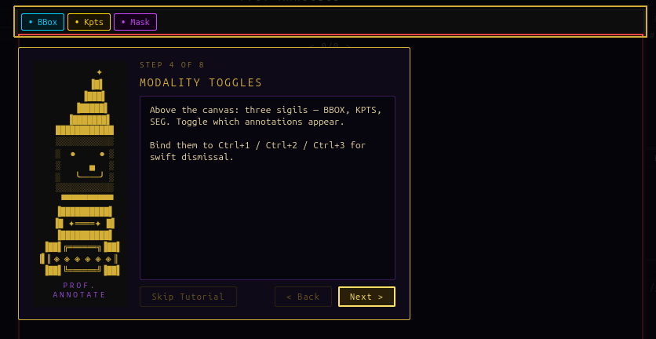

This panel shows bbox(bounding boxes), kpts(keypoints), and mask(segmentation masks). The annotator can toggle these modalities on and off to switch between them from the overlayed view of the annotations on the current image.

6. The Canvas:

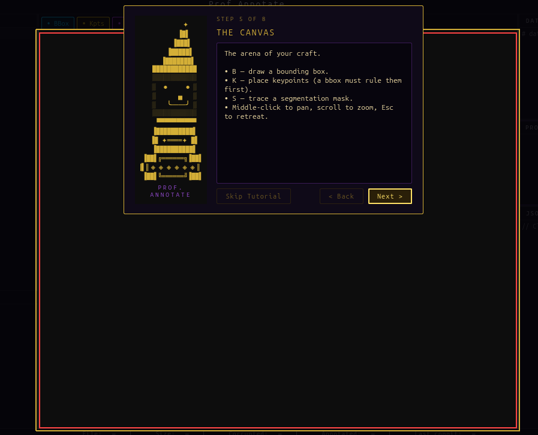

The canvas is the place where the annotator will be editing/drawing annotations on the current image.

7. The JSON Viewer: 

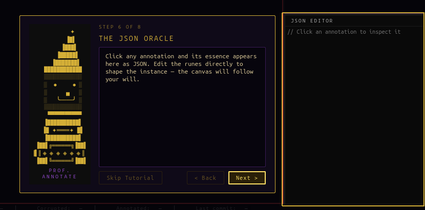

In this section, the current selected annotation can be viewed and edited very easily as a json object. 

8. The 'data.yaml' Editor: 

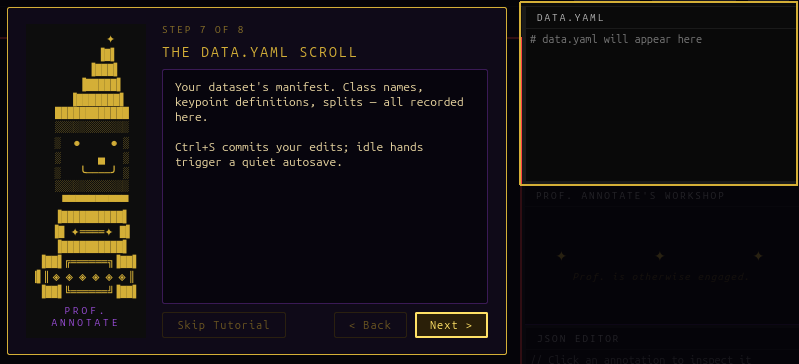

data.yaml is a pivotal file that contains the dataset configuration and metadata. This file is used to define the dataset structure, classes, and other metadata that are used by the annotator and the model training process. The contents of the data.yaml file is displayed in this section and is editable directly via the in-built text editor with an autosave feature that saves the file to disk periodically when edited.

9. Keybindings Button: 

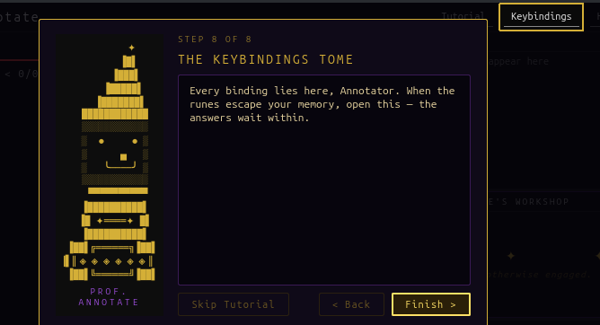

This button is pivotal as it shows all the keybindings available to the annotator. Since the focus of the application is productivity, the keybindings are designed to be intuitive and easy to remember, so the annotator can quickly perform common tasks without needing to refer to a manual.

10. Conclusion: 

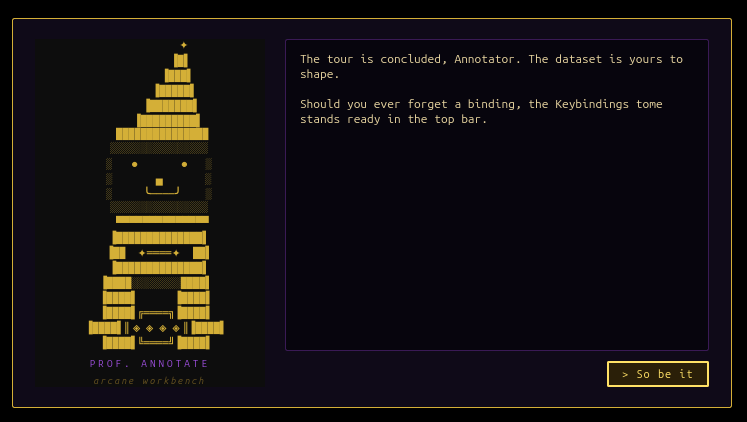

After providing an overview of the UI, Prof Annotate leaves it in the good hands of the annotator, who shall use his workshop for performing annotations on images.
